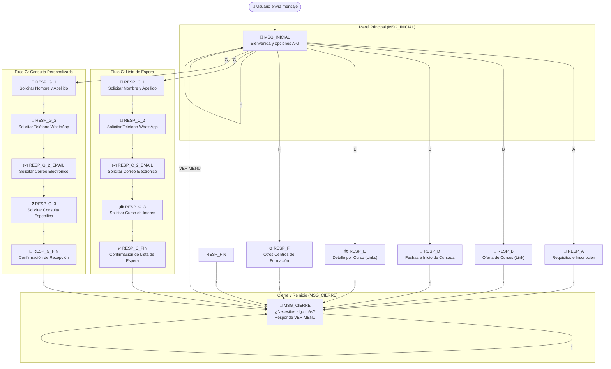

# 🌳 Árbol de Decisión Conversacional - CFP N° 412

Este documento describe de forma clara y accesible la estructura, lógica de navegación y extracción de datos del **Árbol de Decisión Conversacional** utilizado por el bot de WhatsApp del **Centro de Formación Profesional N° 412 (CFP 412)**.

---

## 📌 1. Resumen Ejecutivo

El chatbot opera como un asistente automatizado para orientar a aspirantes y estudiantes sobre la oferta educativa del CFP N° 412.

### Características Principales:
* **Menú Principal Interactivos (Opciones A a G):** Proporciona información sobre requisitos, oferta académica, fechas, enlaces detallados y búsquedas externas.
* **Captura Secuencial de Leads (Flujos C y G):** Permite registrar datos de contacto (Nombre, Teléfono, Email) para la lista de espera de vacantes o para consultas personalizadas.
* **Cierre y Reinicio Continuo (`MSG_CIERRE`):** Al finalizar cualquier consulta, el bot ofrece volver al menú principal mediante el comando `VER MENU`.
* **Tolerancia a Mayúsculas/Minúsculas:** El motor procesa las respuestas sin importar el caso (`A` / `a`, `VER MENU` / `ver menu`).

---

## 🗺️ 2. Diagrama de Flujo (Mermaid)

---

## 📊 3. Matriz de Extracción de Datos (Leads)

Durante la interacción, el bot captura información relevante del usuario y la asigna a variables de contexto. Estos datos son persistidos automáticamente en la fuente configurada (CSV o Google Sheets).

| Variable Extraída | Nodo Origen | Tipo de Respuesta Capturada | Uso / Propósito |
| :--- | :--- | :--- | :--- |
| `Opcion_Elegida` | `MSG_INICIAL` | Opción del menú (`A`, `B`, `C`, `D`, `E`, `F`, `G`) | Identifica la intención inicial del usuario. |
| `Nombre_y_Apellido` | `RESP_C_1` / `RESP_G_1` | Texto libre enviado por el usuario | Registro de identificación personal para contacto. |
| `Telefono_WhatsApp` | `RESP_C_2` / `RESP_G_2` | Número telefónico introducido | Canal de contacto alternativo o de validación. |
| `Correo_Electronico` | `RESP_C_2_EMAIL` / `RESP_G_2_EMAIL` | Dirección de e-mail | Vía de notificación formal. |
| `Curso_Interes` | `RESP_C_3` | Nombre o especialidad del curso | Registro de demanda en lista de espera. |
| `Consulta_Personalizada` | `RESP_G_3` | Texto libre con la duda/pregunta | Mensaje a derivar a un operador humano. |
| `Accion_Reinicio` | `MSG_CIERRE` | `VER MENU` u otra entrada en cierre | Evento de retorno al flujo inicial. |

---

## 📑 4. Detalle de Nodos y Mensajes

### 🏠 Menú Principal (`MSG_INICIAL`)
* **ID:** `MSG_INICIAL`
* **Mensaje presentado:**
  > 👋 Hola, te comunicaste con el Centro Formación Profesional nº 412. ¿En qué podemos ayudarte?  
  > Por favor, responde con la letra de la opción sobre la que deseas consultar:  
  > • **A.** Requisitos e inscripción a los cursos  
  > • **B.** Ver la oferta de cursos disponible  
  > • **C.** Anotarse en lista de espera  
  > • **D.** Fechas e inicio de cursada  
  > • **E.** Información detallada sobre un curso específico  
  > • **F.** Buscar cursos en otros Centros de Formación  
  > • **G.** Otros (Escribir una consulta personalizada)
* **Variable extraída:** `Opcion_Elegida`
* **Transiciones:**
  * `A` ➔ `RESP_A`
  * `B` ➔ `RESP_B`
  * `C` ➔ `RESP_C_1`
  * `D` ➔ `RESP_D`
  * `E` ➔ `RESP_E`
  * `F` ➔ `RESP_F`
  * `G` ➔ `RESP_G_1`
  * `*` (Cualquier otra entrada) ➔ Permanece en `MSG_INICIAL`

---

### 📄 Opción A: Requisitos e Inscripción
* **ID:** `RESP_A`
* **Mensaje:** Informa la documentación requerida (1 folio oficio, 2 fotocopias de DNI, 1 fotocopia de título) y la fecha de inicio de inscripción (a partir del 02/12/26 de 18 a 21 hs para el ciclo 2027).
* **Transición:** `*` ➔ `MSG_CIERRE`

---

### 🔗 Opción B: Oferta de Cursos
* **ID:** `RESP_B`
* **Mensaje:** Enlace directo al catálogo virtual de la Municipalidad de Lomas de Zamora:
  `https://aprender.lomasdezamora.gov.ar/courses/academies/centrodeformacionprofesionalcfpndeg412-principal`
* **Transición:** `*` ➔ `MSG_CIERRE`

---

### 📝 Opción C: Anotarse en Lista de Espera (Secuencia Completa)

1. **`RESP_C_1`**: *"Para anotarte en la lista de espera, por favor responde a este mensaje con tu Nombre y Apellido:"*
   * *Extrae:* `Nombre_y_Apellido` ➔ Pasa a `RESP_C_2`
2. **`RESP_C_2`**: *"¡Gracias! Por favor, indícanos un número de teléfono de WhatsApp de contacto:"*
   * *Extrae:* `Telefono_WhatsApp` ➔ Pasa a `RESP_C_2_EMAIL`
3. **`RESP_C_2_EMAIL`**: *"¡Perfecto! Ahora indícanos tu correo electrónico:"*
   * *Extrae:* `Correo_Electronico` ➔ Pasa a `RESP_C_3`
4. **`RESP_C_3`**: *"Por último, ¿para qué Curso te gustaría anotarte?"*
   * *Extrae:* `Curso_Interes` ➔ Pasa a `RESP_C_FIN`
5. **`RESP_C_FIN`**: Confirma el registro de los datos y sugiere el trayecto de CAD (`https://abc.gob.ar/formacion_profesional/buscador/1492`).
   * *Transición:* `*` ➔ `MSG_CIERRE`

---

### 📅 Opción D: Fechas e Inicio de Cursada
* **ID:** `RESP_D`
* **Mensaje:** Aclara que el ciclo lectivo comenzó en marzo y es anual. Detalla la fecha del próximo proceso de inscripción (02/12/2026 de 18 a 21 hs).
* **Transición:** `*` ➔ `MSG_CIERRE`

---

### 📚 Opción E: Información Detallada sobre Cursos
* **ID:** `RESP_E`
* **Mensaje:** Entrega la lista de enlaces a la plataforma de la Dirección General de Cultura y Educación (ABC) para cada curso:
  * **Motos II:** `https://abc.gob.ar/formacion_profesional/buscador/1489`
  * **CAD:** `https://abc.gob.ar/formacion_profesional/buscador/1492`
  * **Auxiliar Mecánico:** `https://abc.gob.ar/formacion_profesional/buscador/1497`
  * **Inyección Diesel:** `https://abc.gob.ar/formacion_profesional/buscador/1496`
  * **Electricidad del Automóvil:** `https://abc.gob.ar/formacion_profesional/buscador/1485`
  * **Carpintería II:** `https://abc.gob.ar/formacion_profesional/buscador/1495`
  * **Organización de Talleres:** `https://abc.gob.ar/formacion_profesional/buscador/1486`
  * **Inyección Nafta:** `https://abc.gob.ar/formacion_profesional/buscador/1487`
  * **Motos I:** `https://abc.gob.ar/formacion_profesional/buscador/1488`
  * **Informática:** `https://abc.gob.ar/formacion_profesional/buscador/1491`
  * **CAD II:** `https://abc.gob.ar/formacion_profesional/buscador/1493`
* **Transición:** `*` ➔ `MSG_CIERRE`

---

### 🌐 Opción F: Buscar en otros Centros de Formación
* **ID:** `RESP_F`
* **Mensaje:** Enlace al buscador general de Centros de Formación Profesional de la Provincia de Buenos Aires:
  `https://abc.gob.ar/formacion_profesional/buscador`
* **Transición:** `*` ➔ `MSG_CIERRE`

---

### 💬 Opción G: Consulta Personalizada (Secuencia Completa)

1. **`RESP_G_1`**: *"Para ayudarte con tu consulta personalizada, por favor indícanos tu Nombre y Apellido:"*
   * *Extrae:* `Nombre_y_Apellido` ➔ Pasa a `RESP_G_2`
2. **`RESP_G_2`**: *"¡Gracias! Por favor, indícanos un número de teléfono de WhatsApp de contacto:"*
   * *Extrae:* `Telefono_WhatsApp` ➔ Pasa a `RESP_G_2_EMAIL`
3. **`RESP_G_2_EMAIL`**: *"¡Perfecto! Ahora indícanos tu correo electrónico:"*
   * *Extrae:* `Correo_Electronico` ➔ Pasa a `RESP_G_3`
4. **`RESP_G_3`**: *"Por último, escribe a continuación tu consulta o pregunta en un solo mensaje para que podamos ayudarte:"*
   * *Extrae:* `Consulta_Personalizada` ➔ Pasa a `RESP_G_FIN`
5. **`RESP_G_FIN`**: *"¡Muchas gracias! Alguien va a responder a tu pregunta a la brevedad. ¡Saludos!"*
   * *Transición:* `*` ➔ `MSG_CIERRE`

---

### 📌 Estado de Cierre (`MSG_CIERRE`)
* **ID:** `MSG_CIERRE`
* **Mensaje:**  
  > 📌 Si necesitas consultar algo más, responde **VER MENU** para volver al inicio.
* **Variable extraída:** `Accion_Reinicio`
* **Transiciones:**
  * `VER MENU` (o `ver menu`) ➔ `MSG_INICIAL`
  * `*` (Cualquier otro mensaje) ➔ Permanece en `MSG_CIERRE`

---

## ⚙️ 5. Reglas del Motor de Decisión (`motorDecision`)

1. **Carga dinámica:** El flujo se define en el archivo JSON `./flows/flow_cfp412.json` e interactúa mediante la librería precompilada `motor-decision`.
2. **Normalización de respuestas:** El motor realiza una comparación case-insensitive y recorta espacios (`trim()`), permitiendo que el usuario ingrese tanto mayúsculas como minúsculas.
3. **Comportamiento del comodín `*`:**
   * En nodos de pregunta abierta (como `RESP_C_1`, `RESP_G_3`), la entrada del usuario se toma como el valor asignado a la clave `extractData`.
   * En nodos informativos (como `RESP_A`, `RESP_B`, `RESP_E`), cualquier mensaje del usuario hace avanzar la conversación hacia `MSG_CIERRE`.
